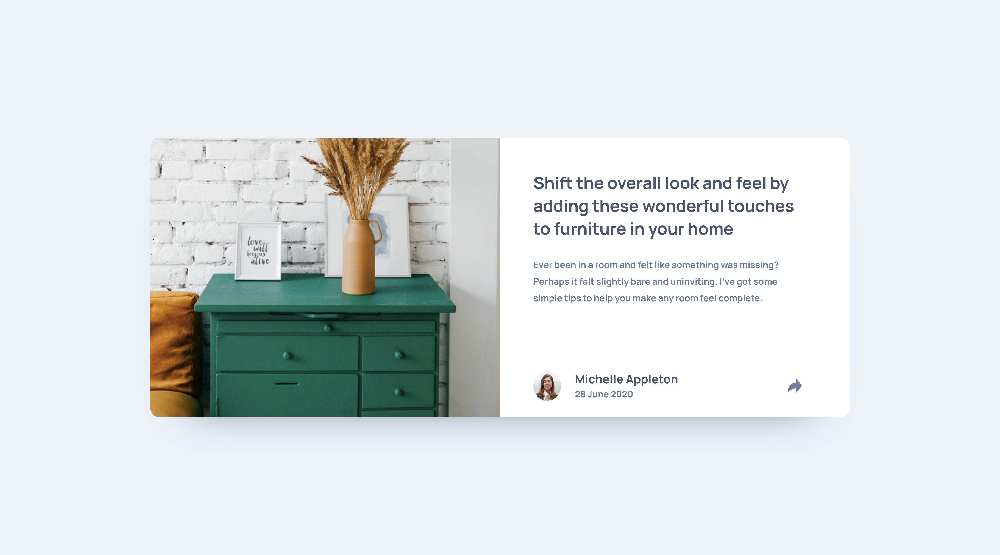
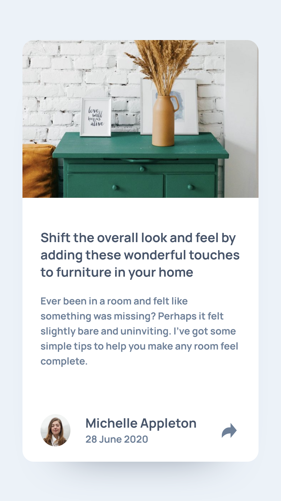

# Frontend Mentor - Article preview component solution

This is a solution to the [Article preview component challenge on Frontend Mentor](https://www.frontendmentor.io/challenges/article-preview-component-dYBN_pYFT). Frontend Mentor challenges help you improve your coding skills by building realistic projects.

## Table of contents

- [Overview](#overview)
  - [The challenge](#the-challenge)
  - [Screenshot](#screenshot)
  - [Links](#links)
- [My process](#my-process)
  - [Built with](#built-with)
  - [What I learned](#what-i-learned)
  - [Useful resources](#useful-resources)
- [Author](#author)

## Overview

### The challenge

Users should be able to:

- View the optimal layout for the component depending on their device's screen size
- See the social media share links when they click the share icon

### Screenshot

### Screenshot




### Links

- Solution URL: [Social proof section solution - GitHub](https://github.com/sunil-sharma-999/Frontend-Mentor-Article-preview-component-solution/)
- Live Site URL: [Social proof section solution](https://sunil-sharma-999.github.io/Frontend-Mentor-Article-preview-component-solution/)

## My process

### Built with

- Semantic HTML5 markup
- CSS custom properties
- Flexbox
- CSS Grid
- javascript
- Mobile-first workflow

### What I learned

Basic Tooltip with pure JS

code;

```css
.s2::after {
  content: '';
  border: size solid transparent;
  border-top-color: color;
  width: value;
  height: value;
}
```

### Useful resources

- [CSS-Tricks](https://css-tricks.com/)
- [Mozilla Firefox MDN](https://developer.mozilla.org/en-US/docs/Web)
- [Stackoverflow](https://stackoverflow.com/)

## Author

- GitHub - [Sunil Sharma](https://github.com/sunil-sharma-999/)
- Frontend Mentor - [@sunil-sharma-999](https://www.frontendmentor.io/profile/sunil-sharma-999)
- Instagram - [@sunil-sharma-9](https://www.instagram.com/sunil.sharma.9)
